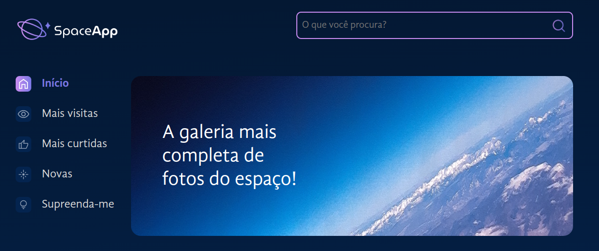

# SpaceApp

Projeto foi desenvolvido em `React` e `styled-components`
com o objetivo de listar uma lista de galáxias, luas, planetas e estrelas. Para listar com essas requisições do projetos foram criados components, estilos globais e filtros de buscas, para atender os requisitos do projeto.

Para visualizar o projeto desenvolvido acesse esse -> [link](https://space-app-lime.vercel.app/)

